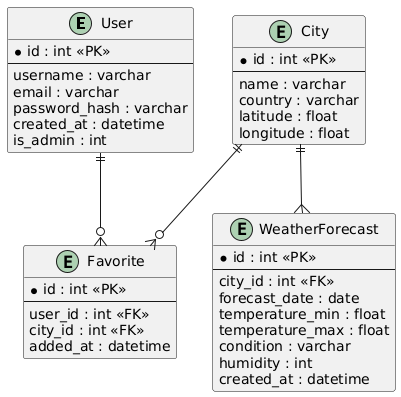
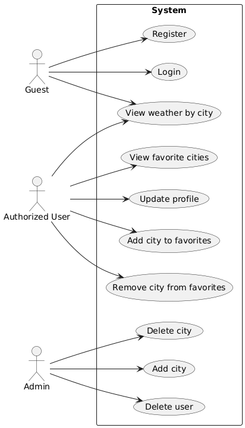
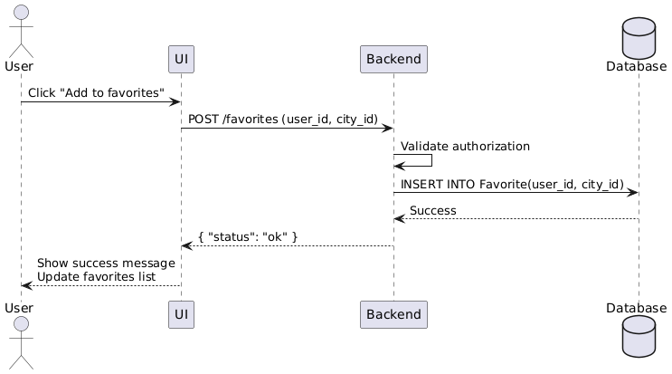
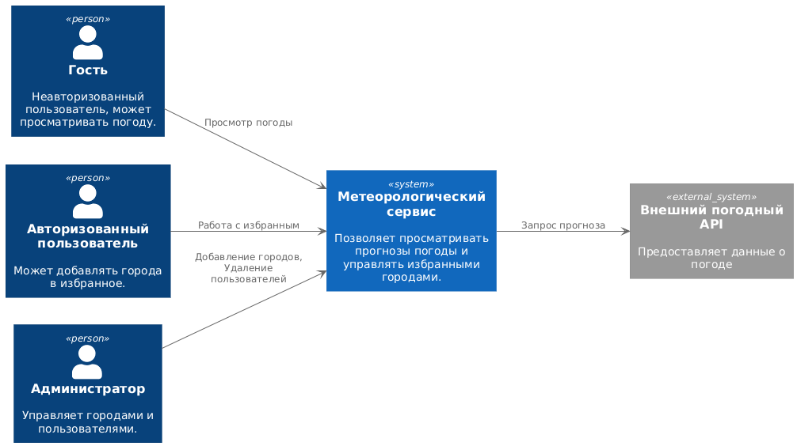

# Метеорологический сервис

Сервис, где пользователи могут добавлять города в "избранное" и просматривать по ним прогноз погоды.

## Состав команды:
    
Глушко Глеб Б22-505
Панкратов Дмитрий Б22-505

# Архитектура проекта

## Стек технологий

1. По умолчанию Backend (Серверная часть):

 - Язык программирования: Python
 - Веб-фреймворк: Django
 - ORM (Object-Relational Mapping): Django ORM
 - API Framework: Django Rest Framework (если планируется создание API)

2. Frontend (Клиентская часть):

 - Язык программирования: JavaScript

3. База данных

 - СУБД: SQlite

4. Дополнительные инструменты:

 - Система управления зависимостями Python: poetry 
 - Система управления пакетами JavaScript: npm
 - Тестирование: Django Test Framework 
 - Среда разработки: VS Сode

## ER Diagram



## Use Case Diagram 



## Sequence Diagram



## C4 Context Diagram



# Локальная установка

1. Установка Docker

    Установите DockerEngine в соответсвии с инструкцией с официального сайта (https://docs.docker.com/engine/install/), если он у вас не установлен

2. Клонировние репозитория

    Склонируйте этот репозиторий

3. Настройка переменных окружения

    Создайте файл `.env` в корне проекта и добавьте туда переменные окружения

    - `SECRET_KEY`: Вы можете сгенерировать секретный ключ вручную или с помощью сайта https://djecrety.ir/
    - `ALLOWED_HOSTS`: Разрешенные адреса или домены, на которых хоститься веб-приложение

4. Запуск

-   Создание образа

```bash
sudo docker build . -t <image name>
```

- Первоначальный запуск

```bash
sudo docker run -p 9999:9999 -d met
```

-   Запуск контейнера

```bash
sudo docker start <container ID>
```
